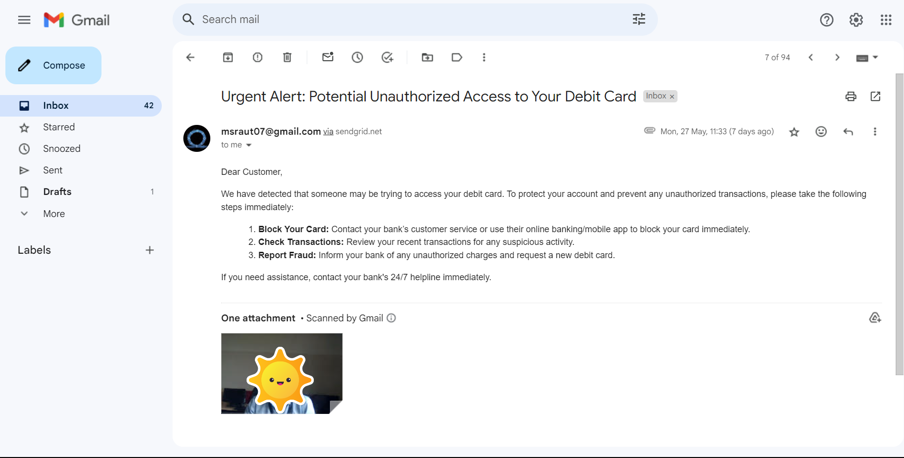
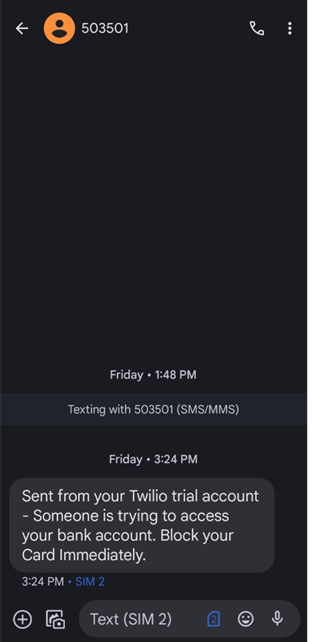
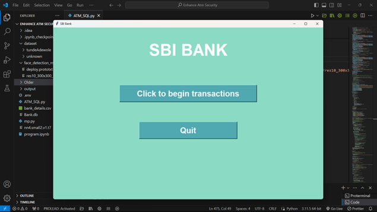
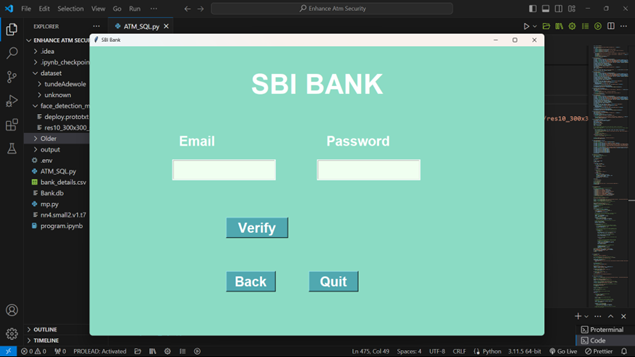
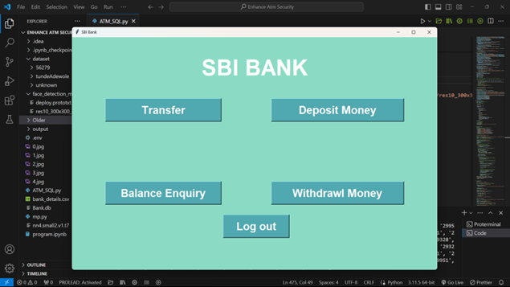
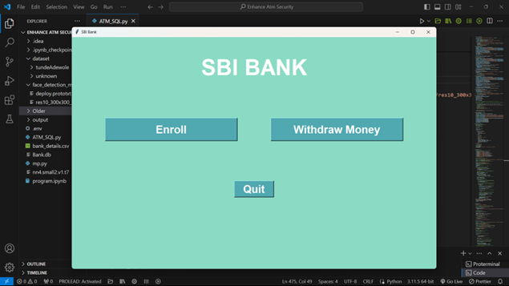
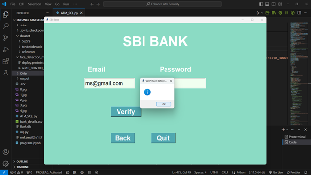
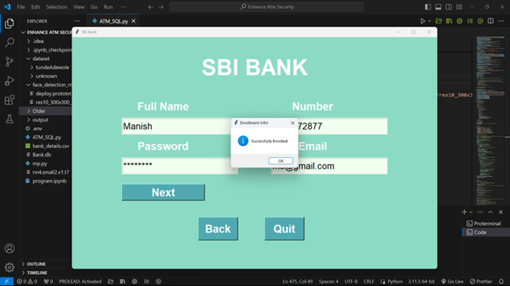

# Enhance ATM Security

Enhance ATM Security is a project aimed at improving the security measures of Automated Teller Machines (ATMs) to prevent fraudulent activities and unauthorized access. With Enhance ATM Security, users can expect advanced security features and protocols to safeguard their financial transactions.

## Features

### Biometric Authentication

- Implement biometric authentication for facial recognition to verify user identity.
- Enhance security by facial recognition to supplementing traditional PIN-based authentication.

### Transaction Monitoring

- Monitor ATM transactions in real-time to detect suspicious activities or anomalies.
- Implement algorithms to identify patterns of fraudulent behavior and trigger alerts for further investigation.

### Alert System

- Integration with Twilio for real-time alerts and notifications, enabling prompt communication in case of security breaches or suspicious activities.
- Integrate Twilio sengrid for the for email alerts.

## Setup Instructions

To set up Enhance ATM Security on your local machine, follow these steps:

1. Clone the repository to your local machine:

git clone https://github.com/prosedus007/enhance-atm-security.git

2. Install dependencies:
Install dependencies according to the requirnments.

3. Create .env File write all the given file in it
TWILIO_ACCOUNT_SID  
TWILIO_AUTH_TOKEN  
SENDGRID_API_KEY  
MONGODB_URI  

4. Run ATM_Software_SQL.py

## Technologies Used

- Python
- DNN
- SQL / MONGO
- Tkinker

## Screenshots

